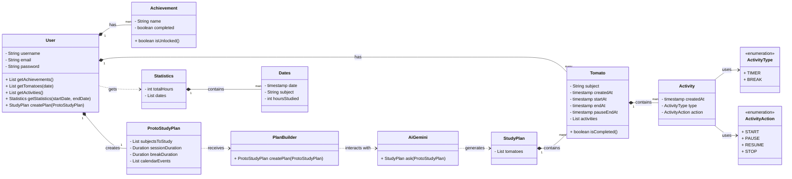
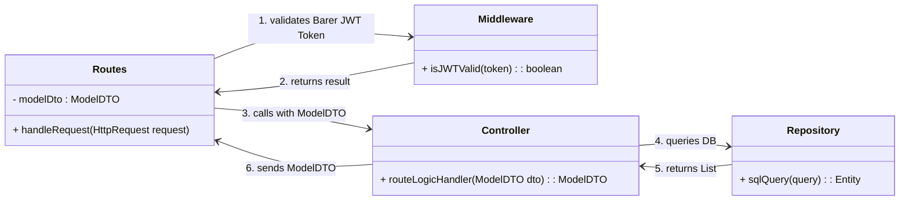

```mermaid
classDiagram
    direction LR

    class User {
        - String username
        - String email
        - String password
        + List<Achievement> getAchievements()
        + List<Tomato> getTomatoes(date)
        + List<Activity> getActivities()
        + Statistics getStatistics(startDate, endDate)
        + StudyPlan createPlan(ProtoStudyPlan)
    }

    class Achievement {
        - String name
        - boolean completed
        + boolean isUnlocked()
    }

    class Tomato {
        - String subject
        - timestamp createdAt
        - timestamp startAt
        - timestamp endAt
        - timestamp pauseEndAt
        - List<Activity> activities
        + boolean isCompleted()
    }

    class Activity {
        - timestamp createdAt
        - ActivityType type
        - ActivityAction action
    }

    class ActivityType {
        <<enumeration>>
        + TIMER
        + BREAK
    }

    class ActivityAction {
        <<enumeration>>
        + START
        + PAUSE
        + RESUME
        + STOP
    }

    class ProtoStudyPlan {
        - List<String> subjectsToStudy
        - Duration sessionDuration
        - Duration breakDuration
        - List<CalendarEvent> calendarEvents
    }

    class StudyPlan {
        - List<Tomato> tomatoes
    }

    class PlanBuilder {
        + ProtoStudyPlan createPlan(ProtoStudyPlan)
    }

    class AiGemini {
        + StudyPlan ask(ProtoStudyPlan)
    }

    class Statistics {
        - int totalHours
        - List<Dates> dates
    }

    class Dates {
        - timestamp date
        - String subject
        - int hoursStudied
    }

%% Relationships
    User "1" *-- "many" Tomato: has
    User "1" *-- "many" Achievement: has
    Tomato "1" *-- "many" Activity: contains
    Activity --> ActivityType: uses
    Activity --> ActivityAction: uses
    User "1" *-- "1" ProtoStudyPlan : creates 
    ProtoStudyPlan ..> PlanBuilder: receives
    PlanBuilder ..> AiGemini: interacts with
    AiGemini ..> StudyPlan : generates
    User ..> Statistics: gets
    StudyPlan "1" *-- "many" Tomato: contains
    Statistics "1" *-- "many" Dates: contains
```

```mermaid
classDiagram
    direction LR

    class Routes {
        + handleRequest(HttpRequest request)
        - modelDto : ModelDTO
    }

    class Middleware {
        + isJWTValid(token) : boolean
    }

    class Controller {
        + routeLogicHandler(ModelDTO dto) : ModelDTO
    }

    class Repository {
        + sqlQuery(query) : Entity
    }

    Routes --> Middleware: 1. validates Barer JWT Token
    Middleware --> Routes: 2. returns result
    Routes --> Controller: 3. calls with ModelDTO
    Controller --> Repository: 4. queries DB
    Repository --> Controller: 5. returns List<Entity>
    Controller --> Routes: 6. sends ModelDTO
```